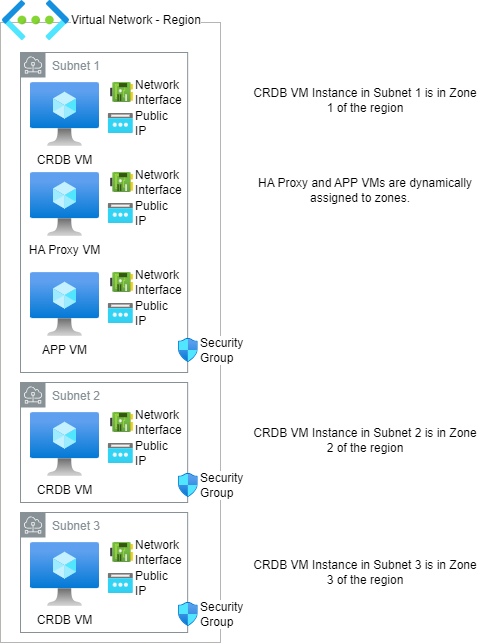

# AZURE-Terraform-CRDB-Module

## TL;DR
```
git clone https://github.com/nollenr/AZURE-Terraform-CRDB-Module.git
cd AZURE-Terraform-CRDB-Module/
```

Edit the `terraform.tfvars` file.

```
terraform init
terraform apply
```



Terraform HCL to create a multi-node CockroachDB cluster in Azure.   The number of nodes can be a multiple of 3 and nodes will be evenly distributed between 3 Azure Zones.   Optionally, you can include
 - haproxy VM - the proxy will be configured to connect to the cluster
 - app VM - application node that includes software for a multi-region demo

## Security Notes
- `firewalld` has been disabled on all nodes (cluster, haproxy and app).   
- A security group is created and assigned with ports 22, 8080 and 26257 opened to a single IP address.  The address is configurable as an input variable (my-ip-address)  

## Using the Terraform HCL
To use the HCL, you will need to define an Azure SSH Key -- that will be used for all VMs created to provide SSH access.

## Using ARM
You can provision a cluster using ARM but be careful on the availability of VM resources as the machine types may be limited or non-existant in some regions.  

### Run this Terraform Script
```terraform
# See the appendix below to intall Terrafrom, the Azure CLI and logging in to Azure

git clone https://github.com/nollenr/AZURE-Terraform-CRDB-Module.git
cd AZURE-Terraform-CRDB-Module/
```

#### if you intend to use enterprise features of the database 
```
export TF_VAR_cluster_organization={CLUSTER ORG}
export TF_VAR_enterprise_license={LICENSE}
```


#### Modify the terraform.tfvars to meet your needs

```
terraform init
terraform plan
terraform apply
```
To clean up and remove everything that was created

```
terraform destroy
```

### terraform variable crdb_resize_homelv
In Azure, any additional space allocated to a disk beyond the size of the image, is available but unused.  Setting the variable `crdb_resize_homelv` to "yes", will cause the user_data script to attempt to resize the home logical volume to take advantage of the additional space.  This is potentially dangerous and should only be used if you're sure that sda2 is the volume group with the homelv partition.  Typically, if you're using the standard redhat source image defined in by the instance.tf you should be fine.  

## Appendix 
### Finding images
```
az vm image list -p "Canonical"
az vm image list -p "Microsoft"
```
### AZURE Terraform - CockroachDB on VM

#### Install Terrafrom
sudo yum install -y yum-utils
sudo yum-config-manager --add-repo https://rpm.releases.hashicorp.com/AmazonLinux/hashicorp.repo
sudo yum -y install terraform

#### Install Azure CLI
sudo rpm --import https://packages.microsoft.com/keys/microsoft.asc
for RHEL 8
sudo dnf install -y https://packages.microsoft.com/config/rhel/8/packages-microsoft-prod.rpm
sudo dnf install azure-cli

az upgrade
az version
az login (directs you to a browser login with a code -- once authenticated, your credentials will be displayed in the terminal)

### Links:
Microsoft Terraform Docs
https://learn.microsoft.com/en-us/azure/virtual-machines/linux/quick-create-terraform

Sizes for VM machines (not very helpful)
https://learn.microsoft.com/en-us/azure/virtual-machines/sizes

User Data that is a static SH 
https://github.com/guillermo-musumeci/terraform-azure-vm-bootstrapping-2/blob/master/linux-vm-main.tf

### dbworkload
To install pgworkload, be sure that the application instance has completed forming (check the .bashrc file for the function "PGWORKLOAD_INSTALL")
```
DBWORKLOAD_INSTALL
```

### UI Certificates
To avoid warnings from the browser when accessing the database UI, the server needs a cert signed by an authority recognized by the browser.  Let's Encrypt provides signed CAs at no charge.  

Edit the `terraform.tfvars` to supply:
- domain name
- email address assoicated with the domain name

A function is installed in the `.bashrc` named `IUCERT`.  Running this function will install `snapd` and `certbot` which is used by Let's Encrypt to generate CA certificates.  

https://certbot.eff.org/instructions?ws=other&os=fedora 

https://snapcraft.io/docs/installing-snap-on-red-hat

https://letsencrypt.org/getting-started/

Please note that prior to running the function, you'll need to 
- create a DNS 'A' Record for the domain -- the IP address will is the IP of the CRDB server.  This needs to be complete before requesting the cert.

## Making Sense of the TLS Certs Used in This HCL
https://www.cockroachlabs.com/docs/v23.2/create-security-certificates-custom-ca

https://www.cockroachlabs.com/docs/v23.2/security-reference/transport-layer-security#trust-store


There are a lot of TLS objects (see [tls HCL file](tls.tf) ).  To help make sense of the objects and how they are used in CRDB and VM formation, I created this chart to help -- maybe it does, maybe it doesn't.  
| Variable | CRDB  Name| TLS | TLS Name | Directory | Note |
| ------   | ----      | --- | -------- | ----------|  ---- |
| tls_private_key | ca.key | tls_private_key.crdb_ca_keys.private_key_pem | TLS Private Key PEM| my-safe-directory | Private key -- same key used by all nodes. |
|tls_public_key|ca.pub|tls_private_key.crdb_ca_keys.public_key_pem|TLS Public Key PEM| certs | cluster public key stored  in the certs directory.  for encoding messages. |
|tls_cert|ca.crt|tls_self_signed_cert.crdb_ca_cert.cert_pem|TLS Cert PEM| certs | certificate for authenticity |
|tls_self_signed_cert|ca.crt|tls_self_signed_cert.crdb_ca_cert.cert_pem|TLS Cert PEM| | Duplicate of tls_cert for better naming |
|tls_user_cert|client.name.crt|tls_locally_signed_cert.user_cert.cert_pem| certs | these are client certs for logging into the database (other than root's cert) | 
|tls_locally_signed_cert |client.name.crt |tls_locally_signed_cert.user_cert.cert_pem | | Duplicate of tls_user_cert for better naming
|tls_user_key|client.name.key|tls_private_key.client_keys.private_key_pem| cert | the client private key file associated with the client cert (other than root's cert) |


## Unified Architecture / Physical Cluster Replication (PCR)
The HCL now allows you to roll out Primary and Standby Clusters for PCR

Set the appropriate variables in `terraform.tfvars`
```
ua_archiecture_primary_cluster
ua_archiecture_standby_cluster 
ua_archiecture_replication_user_name
ua_archiecture_replication_user_password
```

if both primary and standby are set to no, then a standard single tenant cluster is created.

Set either the primary or standby variable to yes to create a multi-tenant cluster.

If the either the primary or standby is set to yes:
- enterprise license keys are installed
- the `kv.rangefeed.enabled` is set to true
- a repliation user with `system replication` authority is created in the `system` tenant

if the standby is set to 'no'
- admin user is created in the `main` tenant

